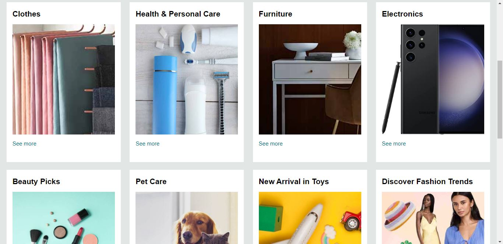
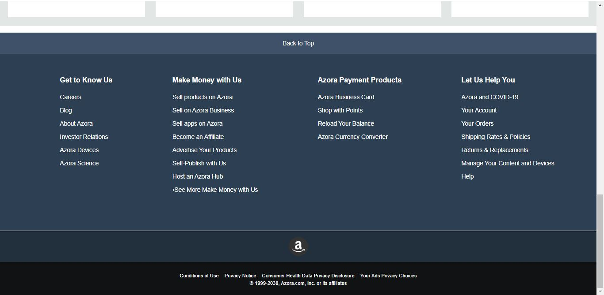

# E-Commerce Store Homepage

This project is a **homepage clone of a popular e-commerce store**, created purely as a **practice project** to improve front-end development skills. The project uses the **brand name “Azora”** to represent the store for originality.

It demonstrates **HTML and CSS skills** by replicating a typical e-commerce homepage layout, including the navigation bar, hero section, product sections, and footer.

---

## 🚀 Features

* **Responsive Navbar** with logo, search bar, language selector, account, and cart sections
* **Hero Section** with a highlighted message area
* **Shop Section** showcasing product categories with images and links
* **Footer** with multi-column navigation and information panels
* **Hover Effects** on interactive elements like buttons, links, and borders

---

## 📂 Project Structure

```
E-Commerce-Store-Homepage/
│
├── index.html           # Main HTML file
├── style.css            # CSS styling
├── images/              # All images used in the project
│    ├── store_logo.png                 # Logo used in navbar and footer
│    ├── hero_image.jpg                 # Hero section banner image
│    ├── american_flag_illustration.png # Language selector flag
│    ├── box1_image.jpg                 # Section images (e.g., Clothes, Electronics)
│    ├── box2_image.jpg
│    ├── box3_image.jpg
│    ├── box4_image.jpg
│    ├── box5_image.jpg
│    ├── box6_image.jpg
│    ├── box7_image.jpg
│    ├── box8_image.jpg
│    ├── screenshot1.png                # Screenshot of the homepage
│    ├── screenshot2.png                # Screenshot of the shop section
│    └── screenshot3.png                # Screenshot of the footer
└── README.md            # Project documentation
```

---

## 💻 Technologies Used

* **HTML5** – Structure of the page
* **CSS3** – Styling and layout
* **Font Awesome** – Icons for cart, location, and menu
* **Flexbox** – Layout alignment and responsive design

---

## 🎨 Project Screenshots





---

## ⚠️ Disclaimer

This project is **for educational purposes only**.
All logos, images, and design elements are used to **practice front-end development skills** and **do not imply affiliation with any real-world company**.

---

## 📈 Learning Outcomes

By completing this project, I practiced:

* Structuring a **complex web page layout**
* Using **CSS Flexbox** for responsive design
* Styling navigation bars, hero sections, and footers
* Implementing **hover effects and interactive UI elements**

---

## 📌 How to View

1. Clone the repository:

   ```bash
   https://github.com/fatima-qaisar/e-commerce-store-homepage.git
   ```
2. Open `index.html` in your web browser.


